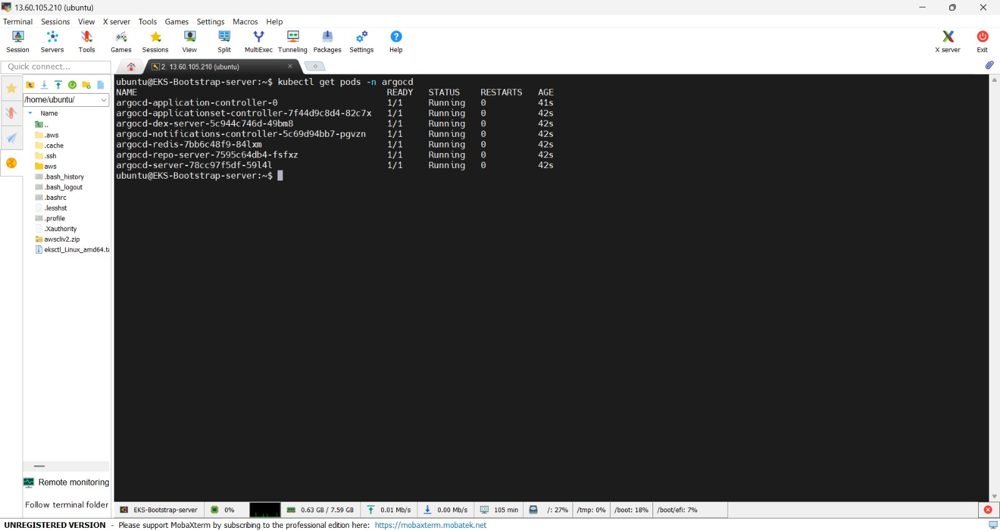
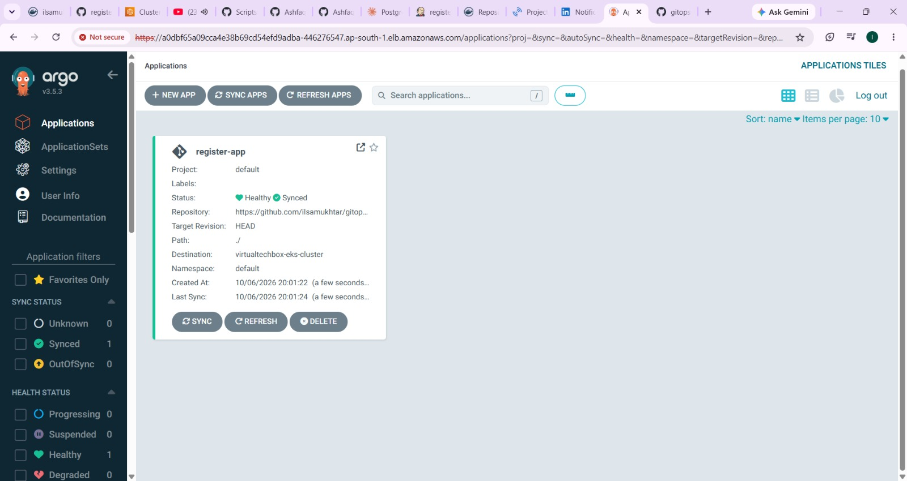
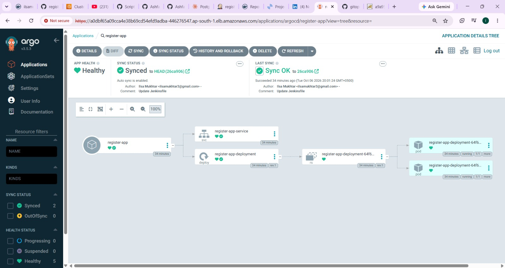
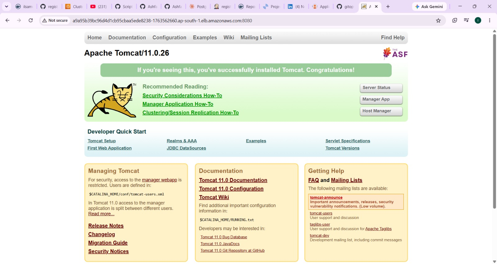

# gitops-register-app: GitOps Manifest Repository (Kubernetes + ArgoCD + Jenkins CD)

This repository is the **single source of truth for deployment** of the `register-app` project.
It contains the **Kubernetes manifests** and the **CD pipeline** that updates them.
**ArgoCD** watches this repository and automatically syncs every change to the **Amazon EKS** cluster.

> The application source code, Dockerfile and CI pipeline are in a separate repository:
> **[register-app](https://github.com/ilsamukhtar/register-app)**

---

## How it works

```
register-app (CI) ──► Docker Hub image ──► triggers CD job
                                              │
                                              ▼
                      gitops-register-app-cd updates deployment.yaml
                                              │  (git commit and push)
                                              ▼
                       This repository  ──►  ArgoCD  ──►  EKS cluster
```

1. The CI pipeline in `register-app` builds, tests, scans and pushes a new image tagged `1.0.0-<build number>`.
2. It triggers the Jenkins CD job `gitops-register-app-cd` and passes the new `IMAGE_TAG`.
3. The CD job (the [`Jenkinsfile`](Jenkinsfile) in this repo) checks out this repository, replaces the image tag in `deployment.yaml` and pushes the commit back to `main`.
4. ArgoCD detects the new commit, compares it with the live cluster and syncs the difference to EKS.

No one runs `kubectl apply` by hand: **Git is the deployment history**, and rollback is just a `git revert`.

## Repository structure

```
gitops-register-app/
├── deployment.yaml   # Kubernetes Deployment (image tag is updated automatically)
├── service.yaml      # Kubernetes Service that exposes the application
├── Jenkinsfile       # CD pipeline: update image tag and push to Git
└── docs/images/      # Screenshots used in this README
```

## CD pipeline stages

Defined in the [`Jenkinsfile`](Jenkinsfile):

| # | Stage | What it does |
|---|---|---|
| 1 | Cleanup Workspace | Starts from a clean workspace |
| 2 | Checkout from SCM | Pulls this repository from GitHub |
| 3 | Update the Deployment Tags | Uses `sed` to replace the image tag in `deployment.yaml` with the `IMAGE_TAG` received from CI |
| 4 | Push the changed deployment file to Git | Commits `deployment.yaml` and pushes it to `main` |

## Tech stack

Kubernetes, Amazon EKS, ArgoCD, Jenkins, Git, GitHub, Docker Hub

## ArgoCD and EKS setup

ArgoCD is installed on the EKS cluster in its own namespace and exposed with a LoadBalancer:

```bash
kubectl create namespace argocd
kubectl apply -n argocd --server-side --force-conflicts \
  -f https://raw.githubusercontent.com/argoproj/argo-cd/stable/manifests/install.yaml
kubectl get pods -n argocd
kubectl patch svc argocd-server -n argocd -p '{"spec": {"type": "LoadBalancer"}}'
```

All ArgoCD components running on the cluster:



## Results and screenshots

### ArgoCD application: Synced and Healthy



### ArgoCD resource tree: Service, Deployment, ReplicaSet and Pods



### Workloads running on EKS


### Application in the browser



## Key learnings

- The GitOps model: Git as the single source of truth for cluster state.
- Safe, automated image-tag promotion from CI to CD.
- Using ArgoCD for continuous sync, drift detection and easy rollback.
- Keeping application code and deployment configuration in separate repositories.

## Future improvements

- Use Helm for multiple environments (dev, staging, prod).
- Add an Ingress controller with HTTPS.
- Add resource limits, health probes and autoscaling (HPA).
- Replace the CD Jenkins job with ArgoCD Image Updater.

## Author

**Ilsa Mukhtar**: DevOps enthusiast
GitHub: [@ilsamukhtar](https://github.com/ilsamukhtar)
